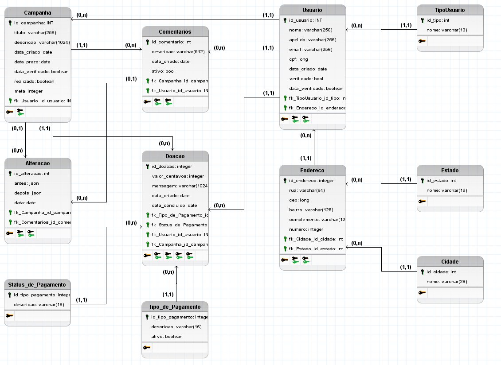

# Donate.IO

Banco de Dados: Aplicação - ADS - 2021/1

Estudo de caso: 
 Plataforma de Doações.

A plataforma tem como objetivo receber doações de usuários.
Podemos utilizar Vakinha como um exemplo de negócio.

### Lista de requerimentos
- [Link](https://github.com/beckerin/donate.io/blob/dev/Requirements.md)

#### Diagrama de Entidade

### Diagrama Lógico

As `issues` que serão as tarefas a serem feitas, serão gerenciadas pelo próprio `Github`.
São formadas pelo pre-fixo do projeto, seu numero de ordenação e breve titulo. Ex:

`DIO-001: Descrição detalhada`

As questões avaliativas e suas respectivas issues são:
- Descrição detalhada do problema `DIO-002` [#2](https://github.com/beckerin/donate.io/issues/2)
- Levantamento de Requisitos `DIO-003` [#3](https://github.com/beckerin/donate.io/issues/3)
- Diagrama Entidade Relacionamento com entidades `DIO-004` [#4](https://github.com/beckerin/donate.io/issues/4)
- Relacionamentos `DIO-005` [#5](https://github.com/beckerin/donate.io/issues/5)
- Atributos identificadores `DIO-006` [#6](https://github.com/beckerin/donate.io/issues/6)
- Atributos simples `DIO-007` [#7](https://github.com/beckerin/donate.io/issues/7)
- Observações `DIO-008` [#8](https://github.com/beckerin/donate.io/issues/8)
- Cardinalidades `DIO-009` [#9](https://github.com/beckerin/donate.io/issues/9)
- Tipos de dados e padronizações `DIO-010` [#10](https://github.com/beckerin/donate.io/issues/10)
- Modelagem Lógica com tipos de dados `DIO-011` [#11](https://github.com/beckerin/donate.io/issues/11)
- Dicionário de Dados `DIO-012` [#12](https://github.com/beckerin/donate.io/issues/12)
- Modelagem física `DIO-013` [#13](https://github.com/beckerin/donate.io/issues/13)
- Criação do banco de dados `DIO-014` [#14](https://github.com/beckerin/donate.io/issues/14)
- Create database and table`DIO-015` [#15](https://github.com/beckerin/donate.io/issues/15)
- Inserts para testes de consultas `DIO-016` [#16](https://github.com/beckerin/donate.io/issues/16)

- Consultas SQL simples utilizando as clausulas <!-- TODO: Criar issue--> 
  - select 
  - where
  - from
  - join
  - funções agregadas
 
 Minimo 5 totais;
